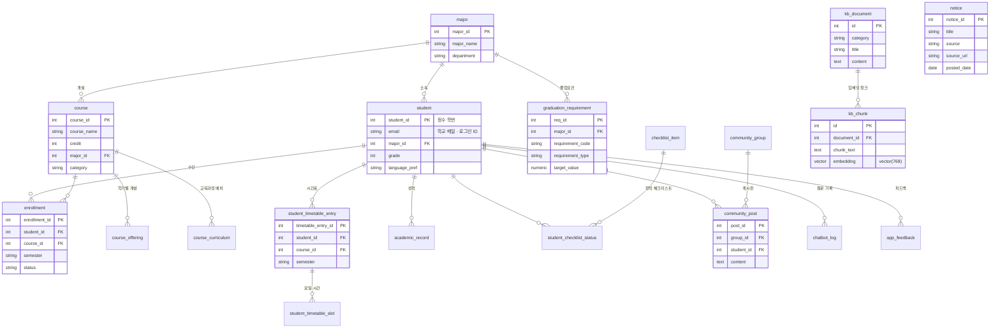
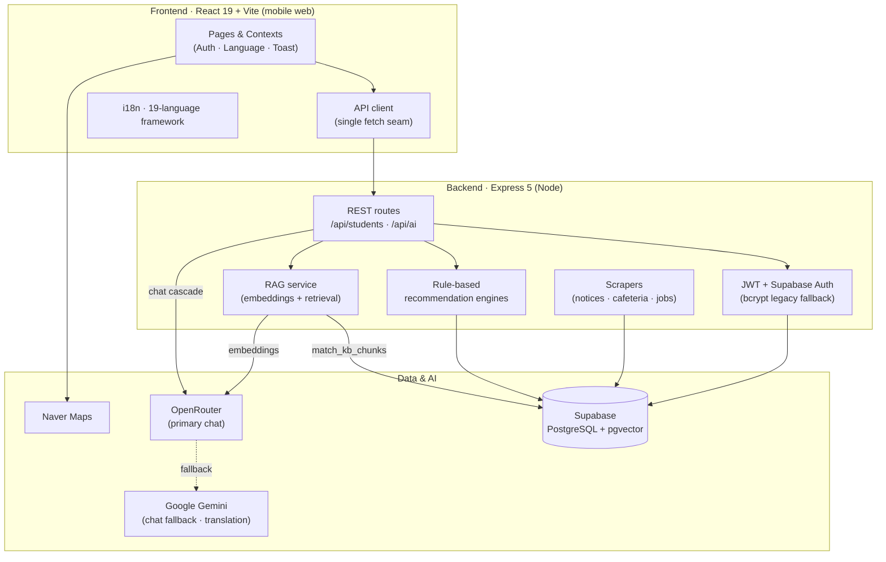
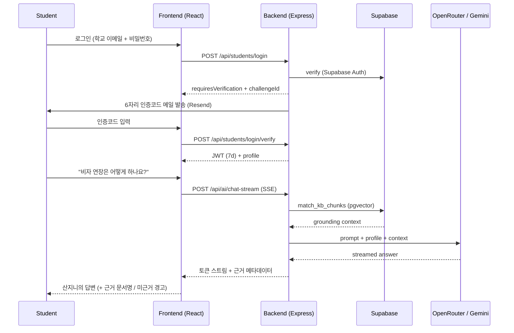

# 안녕! 부산대 (Hey! PNU)

> **부산대학교 외국인 유학생을 위한 원스톱 통합 플랫폼**
> An all-in-one onboarding & academic hub for international students at Pusan National University.
>
> 제7회 PNU 창의융합AI해커톤 · 융합트랙 · 팀 **5 Guys**



> `notice`는 15분 주기 스크래핑으로 채워지며, 최근 공지는 `kb_document`로도 발행되어 어시스턴트가 검색할 수 있다.

---

## 1. 프로젝트 소개 · Project Overview

### 1.1. 개발 배경 및 필요성 · Background & Motivation

**KO** — 부산대학교에는 다양한 국가에서 온 외국인 학부생들이 재학하고 있지만, 이들은 대학생활에 필요한 정보를 찾고 이해하는 과정에서 여러 어려움을 겪고 있다. 설문조사 결과, 정보 접근의 어려움(48.7%), 비자 및 행정 절차의 복잡함(42.3%), 언어 소통의 어려움(36.2%), 교육과정 이해의 어려움(30.5%), 입국 후 초기 정착의 어려움(27.8%) 등이 주요 문제로 나타났다. 특히 학사 일정, 장학금, 수업 및 졸업 요건, 비자·행정 정보, 캠퍼스 생활 정보가 여러 홈페이지와 부서에 분산되어 있어 외국인 학생들이 필요한 정보를 적시에 찾기 어렵다. 또한 언어 장벽과 복잡한 행정 절차로 인해 같은 내용을 반복적으로 문의해야 하는 경우가 발생하여 학생뿐만 아니라 대학 행정 측에도 부담이 되고 있다. 따라서 외국인 학생들이 필요한 정보를 한곳에서 쉽고 빠르게 확인하고, 대학생활 전반을 체계적으로 관리할 수 있는 통합 플랫폼의 필요성이 높다.

**EN** — International undergraduate students at Pusan National University face various challenges in accessing and understanding essential information for campus life. According to our survey, the major difficulties include accessing information (48.7%), complex visa and administrative procedures (42.3%), language barriers (36.2%), understanding the curriculum (30.5%), and initial settlement after arrival (27.8%). Important information such as academic schedules, scholarships, course and graduation requirements, visa procedures, and campus services is scattered across different websites and university departments, making it difficult for international students to find the right information at the right time. Language barriers and complicated administrative procedures can also lead to repeated inquiries, increasing the burden on both students and university staff. Therefore, there is a clear need for an integrated platform that allows international students to access essential information easily, quickly, and in one place while supporting their overall campus life.

### 1.2. 개발 목표 및 주요 내용 · Goals

**KO** — 흩어진 정보를 하나로 모으고, 학생 개개인의 전공·이수 상황·관심 분야에 맞춘 **개인 맞춤형 지원**을 제공하는 것이 목표다. AI 도우미 **산지니(Sanjini)**를 중심으로 다음을 제공한다.

- 다국어 UI와 문화적 맥락을 반영한 현지화
- 전공·졸업요건·관심 분야를 분석한 **AI 수강 과목 추천** 및 **비교과 프로그램 추천**
- 졸업 요건 자동 계산 및 체크리스트, 신입생 정착 체크리스트
- 우선순위·마감일을 반영한 개인화 공지 피드, 커뮤니티, 캠퍼스 맵, 응급 지원

**EN** — Consolidate the scattered information and layer on *personalized* support driven by each student's major, completed credits, and interests. Centered on the AI assistant **Sanjini**, the app offers multilingual localization, personalized course and extracurricular-program recommendations, automatic graduation-requirement tracking, a prioritized notice feed, a community, a campus map, and emergency support.

### 1.3. 세부 내용 · Key Features

| 기능 · Feature | 설명 · Description |
|---|---|
| AI 어시스턴트 (산지니) | 입학·학업·생활·비자·진로 질문에 학생 프로필 기반으로 응답 (RAG 근거 검색 포함) |
| 맞춤 수강 추천 | 전공·이수 학점·졸업 요건·관심 분야를 반영한 다음 학기 과목 추천 (규칙 기반 엔진) |
| 졸업요건 & 학점 관리 | 이수 학점 자동 계산, 영역별 잔여 학점과 졸업 체크리스트 표시 |
| 시간표 & 충돌 감지 | 수강 등록 시 요일·시간 겹침을 검사하고 경고 |
| 비교과 프로그램 추천 | 관심 분야·커리어 목표 기반 교내 비교과 프로그램 추천 (규칙 기반 엔진) |
| 장학금 정보 | GKS·TOPIK·학과별 장학 정보 통합 제공 및 마감일 안내 |
| 공지 통합 | 국제처·학과 게시판을 스크래핑해 원문 링크와 함께 제공 |
| 캠퍼스 맵 | Naver Maps 기반 시설 안내 |
| 커뮤니티 | 국가별·학과별 게시판 자동 배정, 글 작성·좋아요·삭제 |
| 응급 지원 | 119·112·1345 원터치, 국적별 대사관·출입국 연락처, 전세 사기 예방 안내 |
| 다국어 | 19개 UI 언어 프레임워크 · 번역률 EN 100% · KO 95% · ZH 86% · MY 85% · 그 외 진행 중 (미번역 키는 영어로 폴백) |

### 1.4. 기존 서비스 대비 차별성 · Differentiation

| 기능 · Feature | 현재 방식 · Today | Hey! PNU |
|---|---|:---:|
| 통합 서비스 · One-stop platform | 없음 (여러 사이트 분산) | ✅ |
| 과목 추천 · Course recommendation | 없음 | ✅ 개인화 자동 추천 |
| 졸업 요건 관리 · Graduation tracking | 학과 안내문 수동 확인 | ✅ 자동 |
| 장학금 정보 · Scholarships | 국제처 홈페이지 개별 확인 | ✅ 통합 + 마감일 강조 |
| 캠퍼스 맵 · Campus map | 분산 정보 | ✅ 지도 기반 |
| 응급 지원 · Emergency | 개별 검색 | ✅ 원터치 + 연락처 |
| 다국어 · Multilingual | 제한적 (한국어 중심) | ✅ 현지화 |

**KO** — 단순 번역을 넘어 **문화적 맥락을 반영한 현지화**를 적용하고, 입학 준비 단계부터 재학 생활 전반까지 필요한 정보를 하나의 플랫폼에서 원스톱으로 제공한다는 점이 핵심 차별점이다.

**EN** — Beyond literal translation, Hey! PNU applies culturally-aware localization and covers the full journey — from application to daily student life — in a single place.

### 1.5. 사회적 가치 도입 계획 · Social Value

1. **정보 접근성 향상 및 성공적 정착 지원** — 분산된 정보를 통합하고 다국어 AI 지원을 제공해 초기 정착의 혼란과 부담을 줄인다.
2. **학업 및 진로 역량 강화** — AI 과목 추천·졸업요건 체크리스트·비교과 추천으로 자기주도적 학습과 진로 설계를 돕는다.
3. **안전하고 포용적인 캠퍼스 조성** — 응급 연락처 원터치, 국적별 대사관·출입국 안내, 전세 사기 예방 가이드, 시간제 취업(아르바이트) 허가 안내로 위험을 예방하고 유학생의 권익을 보호한다.

---

## 2. 상세설계 · System Design

### 2.1. 시스템 구성도 · Architecture



**AI 챗봇 구조 · Chat pipeline** — 어시스턴트 화면은 SSE 스트리밍 경로(`POST /api/ai/chat-stream`) 하나만 사용한다. OpenRouter가 1차 제공자이며 모델 단위 폴백과 12초 연결 타임아웃을 두고, 모든 모델이 실패하면 Gemini 스트리밍으로 넘어간다.

**RAG** — 임베딩은 OpenRouter(`openai/text-embedding-3-small`, 768차원)로 생성해 Supabase `pgvector`에 저장하고 `match_kb_chunks` RPC로 검색한다. 유사도 임계값 `0.32`는 실측값이다(주제 내 0.376–0.692, 주제 외 0.137–0.262). 답변에는 **근거 문서명을 함께 표시**하고, 근거를 찾지 못한 경우에는 비자·근로·졸업처럼 결과가 중요한 질문에 한해 *"공식 문서에 근거하지 않은 일반 안내"*라고 명시한 뒤 국제처·1345로 안내한다. 토큰 한도로 답변이 잘린 경우(`finish_reason`)에도 완결된 답변처럼 보이지 않도록 표시한다.

### 2.2. 사용 기술 · Tech Stack

**Frontend**
- React `19.2` · React Router `7.18` · TypeScript `6.0`
- Vite `8.0` · Tailwind CSS `4.3` · lucide-react · react-markdown `10.1`
- Naver Maps (NCP) for the campus map

**Backend**
- Node.js `20` (`engines: >=20 <25`) · Express `5.2`
- Supabase JS `2.108` (PostgreSQL + `pgvector`)
- JSON Web Token `9.0` · bcryptjs `3.0` · Joi `18.2`
- cheerio `1.2` (notice / cafeteria board parsing)

**AI / Data**
- OpenRouter — 챗 응답(1차 제공자) 및 임베딩(`openai/text-embedding-3-small`, 768차원)
- Google Gemini — 챗 폴백, 학식 메뉴 번역
- Supabase `pgvector` — 지식베이스 검색(RAG), 문서 351건 · 청크 376건
- 추천 엔진은 LLM을 호출하지 않는 결정론적 규칙 기반 엔진이다 (`backend/ai/`)

**활용한 생성형 AI · AI coding tools** — 자세한 내용은 [3.5](#35-ai-도구-활용--use-of-ai-tools) 참고.

---

## 3. 개발결과 · Results

### 3.1. 전체 시스템 흐름도 · End-to-end Flow



### 3.2. 기능 설명 · Feature Walkthrough

- **로그인 / 회원가입** — 학교 이메일(`@pusan.ac.kr` 등)과 비밀번호로 1차 인증한 뒤, 메일로 받은 6자리 코드를 확인하면 7일 유효 JWT를 발급한다. 회원가입도 같은 방식으로 메일 소유를 먼저 확인한다. 비밀번호 재설정은 이메일 링크 기반이다.
- **홈 대시보드** — 정착 체크리스트 진행률, 최신 공지 캐러셀, 빠른 이동 그리드.
- **학식 · Cafeteria** — PNU 주간 메뉴 스크래핑, 셀별 복수 옵션(정식/일품), 기본 탭은 금정회관 학생 식당. 메뉴 번역은 UI가 `ko`일 때 한국어, 그 외 언어는 영어(Gemini + OpenRouter fallback).
- **AI 어시스턴트 (산지니)** — 학생 프로필(전공·학년·이수 과목·졸업요건)과 RAG 근거를 활용해 응답하며, 근거 문서명을 화면에 표시한다. 근거가 없으면 결과가 중요한 질문에 한해 일반 안내임을 명시하고 국제처·1345로 안내한다.
- **학업 / 시간표** — 수강 등록·삭제, 요일·시간 충돌 감지, 학기별 시간표 보기.
- **수강·비교과·장학 추천** — 규칙 기반 추천 엔진이 전공·이수 상황·관심 분야를 반영해 순위를 매긴다.
- **커뮤니티** — 국적·학과에 따라 게시판이 자동 배정되며 글 작성·좋아요·삭제를 지원한다. 목록은 45초 간격으로 갱신된다.
- **캠퍼스 맵 / 응급 지원 / 취업·인턴십** — Naver Maps 시설 안내, 원터치 긴급 연락, JobKorea 공고 스크래핑.

### 3.3. 기능명세서 · Feature Specification

| 기능 | 주요 엔드포인트 | 인증 | 데이터 |
|---|---|:---:|---|
| 로그인 / 인증코드 | `POST /students/login` · `/login/verify` | – | `student`, Supabase Auth |
| 회원가입 | `POST /students/signup` · `/signup/complete` | – | `student` (메일 확인 후 생성) |
| 비밀번호 재설정 | `POST /students/forgot-password` · `/reset-password` | – | Supabase Auth + Resend |
| AI 어시스턴트 | `POST /ai/chat-stream` (SSE) | ✔ | `kb_chunk` (pgvector), `chatbot_log` |
| 수강 추천 | `GET /ai/course-recommendations` | ✔ | `course`, `enrollment` |
| 졸업요건 / 학점 | `GET /students/graduation-progress` | ✔ | `graduation_requirement`, `enrollment` |
| 시간표 | `POST /students/timetable` · `DELETE` | ✔ | `student_timetable_entry` (트랜잭션 RPC) |
| 공지 | `GET /students/notices` · `/notifications` | ✔ | `notice` (15분 크론 스크래핑) |
| 장학 / 비교과 | `GET /students/scholarships` · `/programs` | ✔ | `scholarship`, `extracurricular_program` |
| 커뮤니티 | `GET`·`POST /students/community/posts` | ✔ | `community_post`, `community_group` |
| 캠퍼스 시설 | `GET /students/campus-facilities` | ✔ | `map_facility` |
| 응급 / 지원 | `GET /students/emergency-guide` · `/pnu-contacts` | ✔ | `emergency_contact`, 번들 데이터 |
| 피드백 | `POST /students/feedback` | ✔ | `app_feedback` |

전체 라우트 목록은 [`backend/routes/`](backend/routes/)에서 확인할 수 있다.

### 3.4. 디렉토리 구조 · Directory Structure

```
omo-korea/
├── frontend/                 # React + Vite + Tailwind
│   └── src/
│       ├── pages/            # 화면 (Home, Academic, AI, Map, Community, …)
│       ├── components/       # 재사용 UI 컴포넌트
│       ├── context/          # Auth · Language · Toast
│       ├── api/              # 단일 fetch 계층 + 응답 매퍼
│       ├── i18n/             # 다국어 사전 (19 locales)
│       └── utils/            # 시간표·캘린더 등 헬퍼
├── backend/                  # Express + Supabase
│   ├── controllers/          # 요청 핸들러
│   ├── routes/               # /api/students · /api/ai
│   ├── services/             # 스크래퍼·AI·인증 서비스
│   ├── ai/                   # 추천 엔진 (course, career, scholarship, …)
│   ├── middlewares/          # auth (JWT + admin)
│   ├── middleware/           # 에러 핸들러 · 언어 미들웨어
│   ├── supabase/             # SQL 마이그레이션
│   ├── scripts/              # 시드 스크립트
│   ├── data/source/          # 원본 공식 문서 (교육과정표 · 학칙)
│   └── tests/                # Jest 테스트 (46 suites)
├── .github/workflows/        # pr-ci.yml · sync-notices.yml (15분 크론)
└── render.yaml · DEPLOY.md   # 배포 설정
```

> `project-docs/`는 `.gitignore` 대상이며 ER 다이어그램만 추적된다.

### 3.5. AI 도구 활용 · Use of AI Tools

> AI 도구별 활용 범위와 AI 생성 코드의 검증·수정 방식에 대한 상세 내용은 [`docs/ai-usage.md`](docs/ai-usage.md)를 참고.

**KO** — 개발 생산성과 결과물 품질을 높이기 위해 전 과정에서 AI 도구를 적극 활용했다.

- **기획 · 설계** — ChatGPT와 Google AI Studio로 방대한 유학 행정 데이터를 정리하고 기능 명세를 빠르게 도출했으며, Claude Design으로 다양한 국적의 사용자가 직관적으로 이해할 수 있는 UI/UX를 설계했다.
- **코드 작성 · 리팩토링** — Cursor, GitHub Copilot, OpenAI Codex, **Claude Code**를 코딩 도구로 사용해 반복 작업을 자동화하고, 복잡한 API 연동·DB 쿼리 설계의 병목을 신속히 해결했다. 특히 인증 구조(Supabase Auth 이전, JWT), 통합 테스트, 보안 점검에 Claude Code를 활용했다.
- **핵심 기능** — 제품에 실제로 탑재된 생성형 AI는 두 가지다. ① 어시스턴트 응답: OpenRouter(1차)와 Gemini(폴백). ② 지식베이스 검색: OpenRouter 임베딩 + Supabase `pgvector`. 학식 메뉴 번역에도 Gemini를 사용한다. 공지 번역 엔드포인트(`/api/ai/translate-announcement`)는 구현되어 있으나 아직 화면에 연결하지 않았다.
- **정확성 검증** — 비자·근로·졸업처럼 틀리면 학생에게 실질적 피해가 가는 정보는 원문(시행세칙·교육과정표)을 근거로 작성한 뒤, 다중 에이전트 교차 검증으로 오역·과장·조건 누락을 잡아내고 수정한 뒤에만 지식베이스에 반영했다.

**EN** — AI tools were used across the whole cycle: ChatGPT / Google AI Studio for planning and spec extraction, Claude Design for UI/UX, and Cursor / GitHub Copilot / OpenAI Codex / **Claude Code** for implementation, refactoring, integration testing, and a security review of the authentication layer. In the shipped product, generative AI does two things: it answers questions (OpenRouter, with Gemini as fallback) and it powers knowledge-base retrieval (OpenRouter embeddings over Supabase pgvector). Recommendation engines are deterministic and call no model.

---

## 4. 설치 및 사용 방법 · Setup & Run

### Prerequisites
- Node.js 20 이상 24 이하 (`engines: >=20 <25`) · npm
- A Supabase project (PostgreSQL + `pgvector`)
- API keys: OpenRouter and/or Gemini (chat), optional Naver Maps client ID

### 1) Backend
```bash
cd backend
cp .env.example .env      # then fill in the values below
npm install
```

`backend/.env` (핵심 값 · key variables):

| Variable | Notes |
|---|---|
| `PORT` | `3000` (Vite proxy expects this) |
| `SUPABASE_URL` / `SUPABASE_KEY` | Project URL + **service-role** key (server only) |
| `JWT_SECRET` | **Required** — server refuses to start without it. Generate: `node -e "console.log(require('crypto').randomBytes(48).toString('base64url'))"` |
| `APP_BASE_URL` | Frontend URL for password-reset links (`http://localhost:5173`) |
| `GEMINI_API_KEY` | Gemini — chat fallback and cafeteria menu translation |
| `OPENROUTER_API_KEY` / `OPENROUTER_MODEL` | Primary chat provider **and RAG embeddings** — required for the assistant to find sources |
| `RESEND_API_KEY` / `RESEND_FROM_EMAIL` | Sign-up and login verification codes, password-reset mail |

### 2) Frontend
```bash
cd frontend
cp .env.example .env
npm install
```

`frontend/.env`: set `VITE_API_BASE_URL` and `VITE_NAVER_MAP_CLIENT_ID`. Never put secrets in `VITE_*` variables — Vite inlines them into the shipped JavaScript.

| Variable | Notes |
|----------|--------|
| `VITE_API_BASE_URL` | `/api` in development (Vite proxies it to `:3000`); the full `https://…/api` origin when deployed |
| `VITE_NAVER_MAP_CLIENT_ID` | NCP Maps Client ID (public, domain-locked) |

> 브라우저 번들에는 데이터베이스 자격증명이 전혀 포함되지 않는다. 커뮤니티 피드를 포함한 모든 데이터 접근은 Express API를 거친다.

### 3) Supabase SQL (run once in the SQL Editor)

**먼저 기본 스키마를 적용한다** — 아래 9개는 대부분 기존 테이블을 변경하는 증분 마이그레이션이므로, 빈 프로젝트에서는 이 파일을 먼저 실행해야 한다.

0. `backend/db/schema.sql` — 기본 테이블 (`student`, `course`, `enrollment`, `notice`, …)

그 다음 순서대로 적용한다 (재실행 가능):

1. `backend/supabase/map_profile_migration.sql` — facility enrichment + academic tables
2. `backend/supabase/support_contacts.sql` — PNU contacts + FAQ
3. `backend/supabase/community.sql` — community groups + posts
4. `backend/supabase/community_realtime.sql` — Realtime publication + post SELECT RLS
5. `backend/supabase/community_group_dedupe.sql` — migrate legacy `dept-*` groups (one-time)
6. `backend/supabase/notice_source.sql` — notice `source` / `source_url` for scraped boards
7. `backend/supabase/extracurricular_program_descriptions.sql` — single `description` column for program body
8. `backend/supabase/post_engagement_and_schedule.sql` — post likes/reports + course schedule columns
9. `backend/supabase/community_major_migration.sql` — group posts by parent major (one-time)
10. `backend/supabase/student_timetable.sql` — timetable tables + transactional RPCs
11. `backend/supabase/feedback.sql` — in-app feedback (`app_feedback`)
12. `backend/supabase/academic_records.sql` · `scholarship.sql` — transcripts, scholarships

> RAG를 사용하려면 `backend/db/migration.sql`도 실행해야 한다 — `pgvector` 확장, `kb_document` / `kb_chunk`(`vector(768)`), `match_kb_chunks` RPC가 여기에 정의되어 있다.

Optional seed scripts (after migrations):

```bash
cd backend
npm run seed:map-profile
npm run seed:support
npm run seed:notices
npm run seed:community-posts   # sample community posts (tag #hey_pnu_seed)
npm run seed:test-fixtures     # test/demo accounts
```

### 4) Run (two terminals)
```bash
# Terminal 1 — API on http://localhost:3000
cd backend && npm run dev

# Terminal 2 — UI on http://localhost:5173
cd frontend && npm run dev
```

학교 이메일(`@pusan.ac.kr`)과 비밀번호로 로그인하면 메일로 6자리 인증코드가 발송된다. 메일 발송에는 `RESEND_API_KEY`가 필요하다.

**심사·시연용 계정** — 메일 없이 바로 로그인할 수 있도록 데모 계정을 두었다. `npm run seed:test-fixtures` 실행 후 `202612345@pusan.ac.kr`로 로그인하고 인증코드는 `123456`을 입력하면 된다.

### Tests
```bash
cd backend  && npm test                    # Jest — 46 suites / 375 tests, Supabase 불필요
cd frontend && npm run test:course-offerings   # 61 assertions
cd frontend && npx tsc -b && npx eslint . && npm run build
```

> `npm test`는 실 DB에 쓰는 `tests/api.test.js`를 제외하고 실행되므로 시드나 네트워크 없이 통과한다.

---

## 5. 소개 및 시연 영상 · Demo Video

> 🎥 **TODO** — 프로젝트 소개 동영상을 교육원 메일(swedu@pusan.ac.kr)로 제출한 뒤, 센터에서 부여받은 YouTube URL을 여기에 추가하세요.
>
> `[](https://youtu.be/XXXXXXXX)`

---

## 6. 팀 소개 · Team — **5 Guys**

| 역할 · Role | 이름 · Name | 소속 · Major |
|---|---|---|
| 팀장 · Leader | Pan Khin Khin Zaw (판킨킨자우) | 정보컴퓨터공학부 · Computer Science |
| 팀원 · Member | Chyu Thant Thinzar (츄딴띤자) | 정보컴퓨터공학부 · Computer Science |
| 팀원 · Member | Htet Kaung San (텟까웅산) | 인공지능 · Artificial Intelligence |
| 팀원 · Member | Byambasuren Tuvshinjargal (비얌바수렝 투브신자르갈) | 정보컴퓨터공학부 · Computer Science |
| 팀원 · Member | Erdene Ochir Nomingoo (에르덴 오치르 노밍구) | 생명과학전공 · Life Sciences |

> 역할 분담과 연락처(대표 이메일 / GitHub)는 팀에서 확정 후 채워 주세요. *Roles and preferred contacts to be filled in by the team.*

---

## 7. 해커톤 참여 후기 · Retrospective

### 팀 회고 · Team retrospective

처음 기획은 "공지를 번역해 주는 앱"이었습니다. 그런데 일반 챗봇에 부산대 아르바이트
허가 규정을 물어보니, 모른다고 하지 않고 그럴듯한 답을 지어냈습니다. 비자와 아르바이트처럼
틀리면 안 되는 정보에서 이건 위험하다고 판단했고, 그 지점에서 방향이 바뀌었습니다.
필요한 건 번역이 아니라 **근거**였습니다.

그래서 실제 부산대 문서와 스크래핑한 공지를 지식베이스로 만들고(문서 351건 · 청크 376건), 근거가 없으면 "모른다"고 답하도록
했습니다. 체감으로 "좋아졌다"고 말하지 않기 위해 40개 질문으로 벤치마크를 만들어, 같은 모델에
지식베이스 유무만 바꿔 비교했습니다.

| 지표 | 일반 AI | Hey! PNU |
|---|---:|---:|
| 정답률 | 32.8% | **91.4%** |
| 환각 (없는 정보를 지어냄) | 26.3% | **2.8%** |
| 모르는 것을 모른다고 답한 비율 | 22.2% | **100%** |

마지막 줄이 저희가 가장 중요하게 생각한 숫자입니다. 비자·아르바이트 정보에서는 자신 있게
틀린 답변이 답변이 없는 것보다 위험하기 때문입니다.

기술적으로 가장 오래 붙잡은 것은 새로운 기능이 아니라 **정확성**이었습니다. 학번으로 이메일
주소를 임의로 만들던 코드가 실제 계정을 로그인 불가 상태로 만들었고, 한국어 강의명을 잘못
분리해 1,924개 과목 중 492개가 화면에 "I"로 표시됐습니다. 둘 다 오류 메시지 없이 조용히
잘못 동작했고, 테스트는 통과하고 있었습니다. 눈에 잘 띄지 않는 이런 결함이 실제 사용자에게는
가장 치명적이라는 것을 배웠습니다.

---

> **TODO** — 팀원별 참여 후기를 작성하세요. *Each member adds a short reflection.*
> 아래 질문에 2~3문장으로 답하면 충분합니다.
>
> - **Pan Khin Khin Zaw** (팀장) — 팀을 이끌며 가장 어려웠던 결정은 제한된 시간 안에 다양한 팀원들의 의견을 조율하고, 어떤 기능을 우선적으로 개발할지 결정하는 것이었습니다. 모든 아이디어를 반영하기보다는 프로젝트의 핵심 목표인 외국인 유학생들의 실질적인 불편을 해결하는 데 가장 필요한 기능을 중심으로 우선순위를 정했습니다.
> - **Chyu Thant Thinzar** — 가장 애착이 가는 기능은 PNU 학식 메뉴·구인 공고·봉사활동 정보를 수집하는 스크래핑 파이프라인입니다. 스크래핑한 데이터를 저장할 데이터베이스 스키마를 설계하고 API로 매핑하여 앱까지 end-to-end로 연결했으며, 저장된 데이터는 Gemini 번역 API를 활용해 사용자의 언어로 번역되어 표시되도록 구현했습니다.
> - **Htet Kaung San** — RAG 파이프라인(OKF)이 실제로 도움이 되는지 감으로 판단하지 않고, OKF 적용/미적용 조건을 같은 40개 질문으로 비교하는 벤치마크를 직접 만들었습니다. 자체 채점을 피하려고 평가 모델은 답변 생성 모델과 다른 벤더로 고정했고, 결과는 정확도 +58.6pt, 환각 비율 -23.5pt로 나왔습니다. 숫자로 보고 나서야 "그냥 잘 되는 것 같다"가 아니라 실제로 얼마나 좋아지는지 확신할 수 있었습니다.
> - **Byambasuren Tuvshinjargal** — 실시간 공지 수집 기능을 구현하면서 웹 스크래핑뿐만 아니라, 수집한 데이터를 정리하고 중복을 처리한 뒤 실제 서비스에 연동하는 과정까지 배울 수 있었습니다. 특히 데이터 형식이 일정하지 않거나 예외가 발생하는 경우를 처리하면서 안정적인 데이터 수집과 동기화의 중요성을 배웠습니다.
> - **Erdene Ochir Nomingoo** — 유학생 당사자로서 학사 공지나 장학금, 졸업 요건처럼 중요한 정보를 제때 찾지 못하거나, 여러 사이트를 돌아다니며 확인해야 할 때 가장 필요하다고 느꼈습니다. 특히 한국어로 된 공지를 이해하고 나에게 해당되는 정보인지 판단하는 과정이 어려웠기 때문에, 필요한 정보를 한곳에서 확인하고 개인 상황에 맞게 안내받을 수 있는 Hey! PNU가 실제 학교생활에 큰 도움이 될 것이라고 생각했습니다.

---

<p align="center">
  <sub>제7회 PNU 창의융합AI해커톤 · 부산대학교 AI융합교육원 · 팀 5 Guys</sub>
</p>
